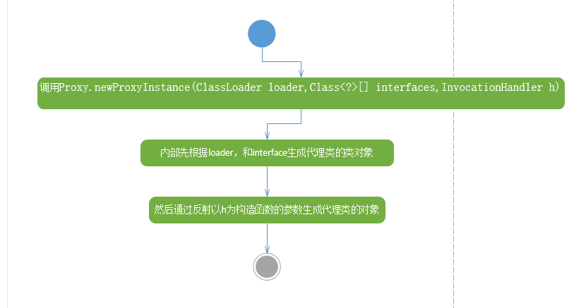

# 动态代理
    动态代理实际上就是对一个由一个（Subject）类的对象
    动态生成一个实现了该类（Subject）的接口的对象
## JDK动态代理本质
    主要脉络
    1. 从Proxy.newProxyInstance(ClassLoader loader,Class<?>[] interfaces,InvocationHandler h)方法中的Class<?> cl = getProxyClass0(loader, intfs)得到代理类的类对象
    2. 从Proxy.newProxyInstance(ClassLoader loader,Class<?>[] interfaces,InvocationHandler h)方法中的final Constructor<?> cons = cl.getConstructor(constructorParams)得到该类对象的构造器对象
    3. 从Proxy.newProxyInstance(ClassLoader loader,Class<?>[] interfaces,InvocationHandler h)方法中的cons.newInstance(new Object[]{h})反射的到代理对象（proxy）。
    细节
    1. getProxyClass0(loader, intfs)中先判断要代理类实现接口的个数，超过65535报错，然后到WeakCache缓存中取代理对象，如果有则从缓存返回，
    没有就从ProxyClassFactory类的apply方法生成代理类，getProxyClass0(loader, intfs)方法中的ProxyGenerator.generateProxyClass(proxyName, interfaces, accessFlags)
    最终生成二进制字节码。不过该方法未开源。
    2. 最终生成的$ProxyO代理类中继承了Proxy，实现了要被代理的类的所有接口。
    其构造函数是    
    public $Proxy0(InvocationHandler var1){
        super(var1);
    }
    实际上调用的是Proxy的构造函数，把传入的调用处理器赋值给Proxy内部调用处理器对象
    实现的方法
    public final void doSomething() throws  {
        try {
            super.h.invoke(this, m3, (Object[])null);
        } catch (RuntimeException | Error var2) {
            throw var2;
        } catch (Throwable var3) {
            throw new UndeclaredThrowableException(var3);
        }
    }
    实际上是调用调用处理器的方法。
    3. 代理类有一个静态代码块
    static {
        try {
            m1 = Class.forName("java.lang.Object").getMethod("equals", Class.forName("java.lang.Object"));
            m3 = Class.forName("com.lnjecit.proxy.Subject").getMethod("doSomething");
            m2 = Class.forName("java.lang.Object").getMethod("toString");
            m0 = Class.forName("java.lang.Object").getMethod("hashCode");
        } catch (NoSuchMethodException var2) {
            throw new NoSuchMethodError(var2.getMessage());
        } catch (ClassNotFoundException var3) {
            throw new NoClassDefFoundError(var3.getMessage());
        }
    }是得到Method对象的。

