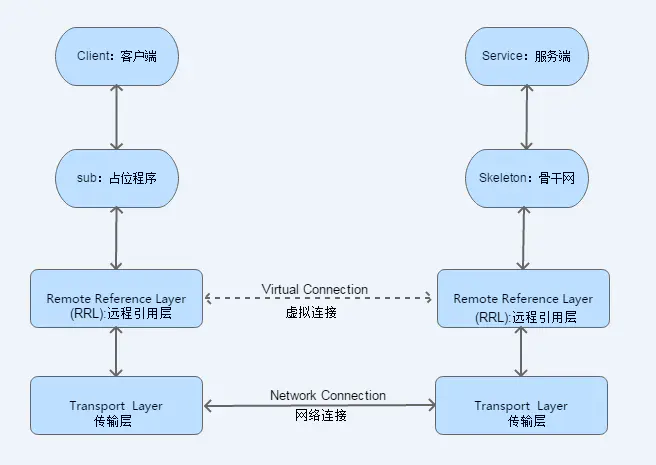
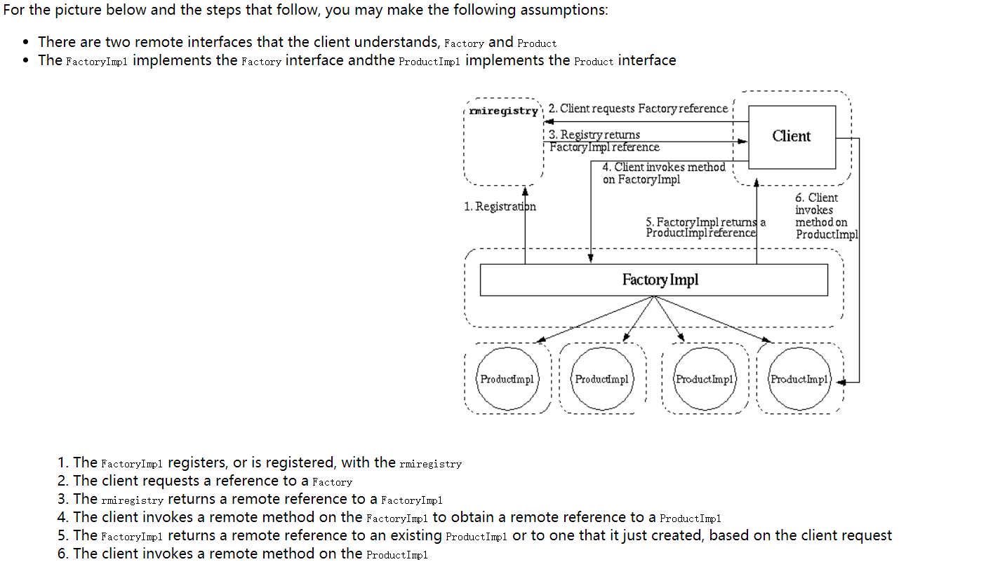

# java.rmi.*架构详解
Java RMI，即 远程方法调用(Remote Method Invocation)，一种用于实现远程过程调用(RPC)(Remote procedure call)的Java API， 能直接传输序列化后的Java对象和分布式垃圾收集。它的实现依赖于Java虚拟机(JVM)，因此它仅支持从一个JVM到另外一个的调用

架构图如下

具体过程
1. 首先创建服务类对象，服务类必须实现UnicastRemoteObject类
此时实际上已经创建了stub和skeleton
2. 然后用RMI registere实例 绑定服务类的对象
3. 再让客户端到RMI register 寻找，找到了返回存根
4. 实际上存根上面有远程的地址，可供调用